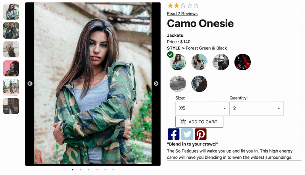

# Project GreenField - Ecommerce Platform

This is a template for an E-commerce platform that dynamically rendering data from a private API allowing users to have an interactive shopping experince.

# Overview Features

## Image Carousel

> Interactive Carousel implemented with React-Slick

The user has the option of moving one image at a time with arrow selectors or by moving further ahead with the bullet selectors, or they can click one of the thumbnail images on the left to select them individually.

## Style Selector

> The Style selector allows the user to preview multiple styles as well as begin their purchase.

Once a style is selected the image carousel a new set of images renders dynamically allowing the user to view multiple styles of the same collection.

If the item is on sale the price will update with the lower price in red.

When the user selects a size and quantity an add to cart button appears which then opens a modal to allow them to complete the purchase.

Below is a description of the product as well as social media buttons to share this item

## Jump Scroll

> A jump scroll brings the user down the Reviews section. Implemented with React-Scroll.

## Tech/Framework used

<strong>Built With:</strong>

- Javascript
- React
- Redux
- Node/Express
- CSS
- MaterialUI
- Babel
- Webpack

<strong>Testing:</strong>

- Circle CI
- Jest
